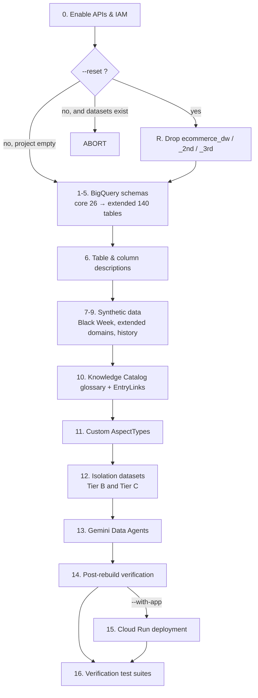
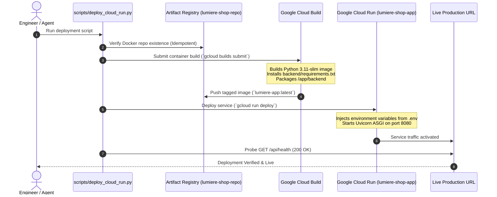

# Deployment & Operational Execution Guide

This document outlines the step-by-step instructions to deploy, run, seed, and verify the LumièreShop platform components across Google Cloud BigQuery, Google Cloud Knowledge Catalog, Google Cloud Gemini Data Analytics Agent, and Google Cloud Run.

---

## 🏁 0. Fresh Project Provisioning (One Command)

Everything below — APIs, schemas, data, Knowledge Catalog glossary, EntryLinks, aspects, isolation datasets and data agents — is provisioned by a single orchestrator against an empty Google Cloud project.

```bash
# Audit prerequisites and print the plan without touching the cloud
python3 scripts/bootstrap_new_project.py --dry-run

# Provision the full platform into an EMPTY project
python3 scripts/bootstrap_new_project.py

# Provision the platform AND deploy the web application
python3 scripts/bootstrap_new_project.py --with-app
```

Configuration comes exclusively from `.env` (`GCP_PROJECT_ID`, `BQ_DATASET_ID`, `BQ_LOCATION`, …). No project identifier is hardcoded in any script.

### Rebuilding a project that already has data

> [!CAUTION]
> `01_create_schema.py` creates tables with `create_table(exists_ok=True)`. A table that already exists **keeps its old schema forever**. A column that was renamed or added in the code is silently *not* applied, and the subsequent data load then either fails or writes into the wrong shape.

To make that impossible to hit by accident, the bootstrap runs a **staleness check** and **aborts** if any of the three target datasets already exist and `--reset` was not supplied:

```
❌ ABORTED: these BigQuery datasets already exist:
     • ecommerce_dw
     • ecommerce_dw_2nd
     • ecommerce_dw_3rd
   Re-run with --reset to drop them first.
```

```bash
# Rebuild an existing project from a genuinely clean slate (DESTRUCTIVE)
python3 scripts/bootstrap_new_project.py --reset

# Full rebuild AND redeploy the application
python3 scripts/bootstrap_new_project.py --reset --with-app
```

`--reset` runs [`scripts/00_reset_datasets.py`](scripts/00_reset_datasets.py), which drops all three datasets with `delete_contents=True` and then **re-queries the project to verify the deletion actually took effect** before the pipeline continues.

> [!WARNING]
> The reset permanently deletes `agent_interaction_logs`. That table records demo chat history and is **not** regenerable from a seed. Everything else in the warehouse is fully reproducible from seed `42`.

The reset script can also be run on its own:

```bash
python3 scripts/00_reset_datasets.py --dry-run   # report what would be dropped
python3 scripts/00_reset_datasets.py             # interactive: type the project ID
python3 scripts/00_reset_datasets.py --force     # non-interactive
```

### Stage Order



Any stage returning a non-zero exit code aborts the whole run immediately — there is no partial-success path.

### Determinism

| Property | Guarantee |
| :--- | :--- |
| Synthetic data | Seeded (`--seed`, default `42`). The same seed reproduces identical orders, sessions, events and revenue. |
| Table set | Declared in `01_create_schema.py` and `11_create_extended_schema.py`, not discovered at runtime. |
| Glossary | Declared in `config/business_glossary.yaml`, the single source of truth. |
| Tier B / Tier C | Derived from Tier A by copy, so row counts are identical by construction; only metadata differs. |

### The Glossary Integrity Gate

Stage 10 (`09_create_dataplex_glossary.py`) runs `verify_metadata_integrity.py --strict` before it deploys anything, and aborts on any finding. This is not a separate pipeline step — it is built into the stage.

It exists because metadata that contradicts the warehouse is *worse than no metadata*: a certified formula pointing at a renamed column does not fail to help, it makes the agent confidently wrong. The check runs offline against the schema-creation scripts, needs no credentials, and takes about a second.

To run it by hand at any time:

```bash
python3 scripts/verify_metadata_integrity.py          # report
python3 scripts/verify_metadata_integrity.py --strict # exit 1 on any finding
```

> [!IMPORTANT]
> `config/business_glossary.yaml` is the only glossary file. It is read directly by the deploy script. Do not reintroduce a second serialised copy — a duplicated JSON manifest previously drifted from the YAML, and because the deploy script read the JSON while validation read the YAML, glossary edits could be silently discarded at deploy time.

---

## 🚀 1. Google Cloud Run Automated Deployment

The containerized FastAPI backend and Material Design 3 frontend are deployed as a managed, serverless microservice to Google Cloud Run.

### 🏗️ Build & Deployment Pipeline Architecture



### 📋 Prerequisites & Configuration
All configuration variables are loaded dynamically from `.env`:
* `GCP_PROJECT_ID`: Target GCP Project ID (e.g. `lumiere-shop-504709`).
* `BQ_LOCATION`: Target region for Artifact Registry and Cloud Run (e.g. `europe-west4`).
* `BQ_DATASET_ID`: Primary dataset (e.g. `ecommerce_dw`).
* `BQ_DATASET_2ND_ID`: Second dataset for comparison (`ecommerce_dw_2nd`).
* `BQ_DATASET_3RD_ID`: Third dataset for comparison (`ecommerce_dw_3rd`).
* `DATA_AGENT_ID`: Gemini Data Analytics Agent identifier.
* `USER_NAME_SCREEN`: `"on"` / `"off"`.

### ⚡ One-Step Deployment Execution
Execute the automated deployer from the repository root:
```bash
python3 scripts/deploy_cloud_run.py
```

### 🔍 Verification & Health Check
Verify that the service is running and responsive:
```bash
# 1. Inspect HTTP Health Check
curl -s -f https://lumiere-shop-app-htjxtcbs5a-ez.a.run.app/api/health

# 2. Verify Frontend Assets
curl -s https://lumiere-shop-app-htjxtcbs5a-ez.a.run.app/ | grep -i "Lumière"
```

### ✅ Full Functional Smoke Test (run after every deployment)

A health check alone is **not sufficient**. On Cloud Run the application authenticates as the
compute service account rather than the deploying engineer's end-user credentials, so
BigQuery, Google Cloud Knowledge Catalog and the Conversational Analytics API must each be
exercised explicitly. Run all five stages:

```bash
BASE=https://lumiere-shop-app-htjxtcbs5a-ez.a.run.app

# 1. Public access (must be 200, not 403 — confirms --allow-unauthenticated)
curl -s -o /dev/null -w "%{http_code}\n" $BASE/

# 2. Configuration (project id, dataset, active discovery prompt)
curl -s $BASE/api/health

# 3. BigQuery reachable from the service account (alert-screen KPIs)
curl -s $BASE/api/kpi/summary

# 4. Knowledge Catalog discovery + agent provisioning
curl -s -X POST -H "Content-Type: application/json" -d '{}' $BASE/api/prepare-data

# 5. Live agent conversation (the slowest and most failure-prone stage)
curl -s -X POST -H "Content-Type: application/json" \
  -d '{"prompt":"Did we have out-of-stock events on bestselling Beauty products, and what was the estimated lost sales impact?","session_id":"smoke-1"}' \
  $BASE/api/chat
```

Expected results:

| # | Stage | Expected outcome |
|---|-------|------------------|
| 1 | Public access | `200` |
| 2 | Health | `status: ok`, `project_id: lumiere-shop-504709`, the approved discovery prompt present |
| 3 | BigQuery | Beauty variance `-520870.86`; drivers `408681.0` / `62386.0` / `49803.86` |
| 4 | Knowledge Catalog | `table_count: 44`, `term_count: 17`, `agent_configured: true` |
| 5 | Agent chat | Certified answer **EUR 62,386.00**, and the gross figure EUR 2,003,060.60 must NOT be presented as the loss |

> [!IMPORTANT]
> Use a **distinct `session_id` per agent**. The Conversational Analytics API binds a
> conversation to exactly one data agent; reusing one session id across agents returns
> `HTTP 400: The agent ... does not match the agent associated with the conversation`.
> The web application already allocates `SESS-AGENT{A,B,C}-*` separately, so this affects
> command-line testing only.

> [!NOTE]
> The agent's visible thinking stream may show one or two intermediate
> **"Query execution failed"** steps (typically an attempt to read `INFORMATION_SCHEMA`,
> which is blocked by the grounding context) before it self-corrects. This is expected
> behaviour and not a deployment defect.

---

## 📦 2. Production Service Reference
* **Cloud Run Service**: `lumiere-shop-app`
* **Region**: `europe-west4`
* **Artifact Registry**: `europe-west4-docker.pkg.dev/lumiere-shop-504709/lumiere-shop-repo/lumiere-app:latest`
* **Live Service URL**: [https://lumiere-shop-app-htjxtcbs5a-ez.a.run.app](https://lumiere-shop-app-htjxtcbs5a-ez.a.run.app)


