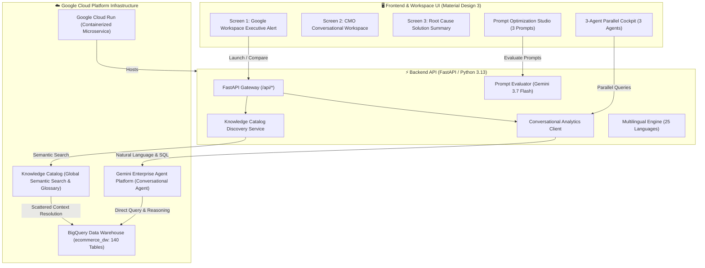
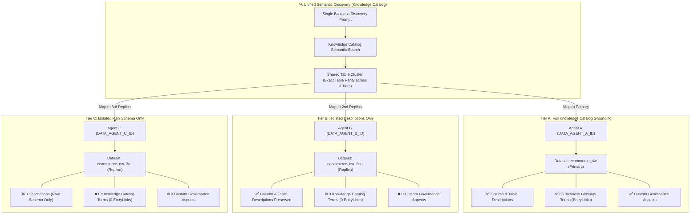

# LumièreShop — Developer Onboarding & Architectural Guide

Welcome to the **LumièreShop** codebase! This comprehensive guide provides everything new engineers and contributors need to understand the architecture, configure local environments, execute composable data pipelines, run automated test suites, and deploy to Google Cloud.

---

## 🏛️ High-Level System Architecture

LumièreShop is an enterprise e-commerce diagnostic platform and executive decision engine. It simulates an active Black Friday e-commerce incident and leverages **Google Cloud Knowledge Catalog** and the **Gemini Enterprise Agent Platform** (BigQuery Conversational Analytics) to discover root causes across complex enterprise datasets.



### 🔬 3-Tier Metadata Isolation Architecture ("Compare Chats")

The **Compare Chats** comparative cockpit provides side-by-side comparative benchmarking to evaluate how differing levels of metadata grounding directly affect LLM SQL generation accuracy and reasoning fidelity.



#### Key Capabilities of Compare Chats:
1. **Single Unified Table Discovery:** Querying Knowledge Catalog once dynamically discovers the optimal table cluster from the 140-table warehouse and provisions the identical table names across all 3 agents simultaneously.
2. **True Physical Isolation:** Because Knowledge Catalog EntryLinks and AspectTypes are bound to canonical table resource URIs (`ecommerce_dw`), replicating tables into `ecommerce_dw_2nd` and `ecommerce_dw_3rd` creates 100% physical metadata isolation without touching the primary dataset.
3. **Dual-Mode Querying:** Operators can broadcast queries simultaneously to all 3 agents or customize/overwrite queries per agent individually using dedicated column-level inputs.
4. **Independent Fast/Thinking Controls:** Each agent column maintains its own independent `[⚡ Fast / 🧠 Thinking]` toggle button.

---

## 📂 Repository Directory Structure

The repository is modular, clean, and composable:

```
lumiere-shop/
├── backend/                        # FastAPI Application & UI Static Assets
│   ├── app/
│   │   ├── services/               # Core Services (Discovery, Evaluator, CA Service)
│   │   │   ├── ca_service.py       # Gemini Conversational Analytics integration
│   │   │   ├── discovery_service.py # Knowledge Catalog semantic search
│   │   │   └── prompt_evaluator.py # 3-way candidate prompt evaluation
│   │   ├── config.py               # Environment configuration loader
│   │   ├── main.py                 # FastAPI application and route definitions
│   │   └── models.py               # Pydantic request/response models
│   └── static/
│       └── index.html              # Material Design 3 single-page application
├── config/                         # Version-Controlled Metadata & Configuration
│   └── business_glossary.yaml      # SINGLE SOURCE OF TRUTH for the enterprise glossary
├── docs/                           # Living Documentation, Guides & Reports
│   ├── images/                     # Canonical screenshots and architecture diagrams
│   ├── DATASET_DATA_AND_SCHEMA_SUMMARY.md # Full 140-table schema & column dictionary
│   ├── DATA_CONTEXT_AND_SEMANTICS_GUIDE.md # Knowledge Catalog search & profiling guide
│   └── DEVELOPER_ONBOARDING_GUIDE.md # This onboarding guide
├── scripts/                        # Sequential Data Provisioning & Pipeline Scripts
│   ├── 01_create_schema.py         # Step 1: Base BigQuery schema creation
│   ├── 02_generate_data.py         # Step 2: Seed synthetic Black Week operational data
│   ├── 04_extend_log_schema.py     # Step 4: Add recommender & bidding log tables
│   ├── 06_update_data_agent.py     # Step 6: Configure Gemini Data Agent instructions
│   ├── 08_setup_dataplex_profiling.py # Step 8: Knowledge Catalog data quality profiling
│   ├── 09_create_dataplex_glossary.py # Step 9: Knowledge Catalog glossary deployment
│   ├── 11_create_extended_schema.py # Step 11: Enterprise extended schemas (104 tables)
│   ├── 12_generate_extended_data.py # Step 12: Populate extended domain records
│   ├── 13_setup_dataplex_aspects.py # Step 13: Attach custom aspect templates
│   ├── 14_generate_historical_data.py # Step 14: Populate multi-week historical actuals
│   ├── 15_add_user_name_to_logs.py # Step 15: Add user_name audit log column
│   ├── 17_add_menu_item_and_agent_no_to_logs.py # Step 17: Add multi-agent audit log columns
│   ├── 18_setup_isolation_datasets.py # Step 18: BigQuery Isolation Datasets (2nd & 3rd Tiers)
│   ├── apply_bq_descriptions.py    # Apply 5-part descriptions to BigQuery tables
│   ├── bootstrap_new_project.py    # Turnkey automated 14-stage cloud deployment orchestrator
│   ├── expand_business_glossary.py # 85-term business taxonomy generator
│   ├── export_bq_tables_to_csv.py  # BigQuery dataset CSV exporter & archiver
│   ├── export_dataset_summary.py   # Markdown schema generator with placeholders
│   ├── generate_docs_pdf.py        # Playwright documentation compiler (HTML & PDF)
│   └── render_architecture_diagram.py # Architecture PNG diagram generator (Playwright)
├── scripts/test/                   # Composable Automated Test Suites
│   ├── 03_verify_agent.py          # Conversational Analytics API REST verification
│   ├── 04b_verify_extended_logs.py # Audit log verification script
│   ├── 05_validate_data_dates.py   # Date cutoff & mathematical variance assertions
│   ├── 10_test_knowledge_search.py # Knowledge Catalog semantic search precision test
│   ├── 16_test_user_name_flow.py   # Screen 0 & user_name audit logging test suite
│   ├── 17_test_compare_chats_logging.py # 3-Agent compare chats audit logging test suite
│   ├── 18_test_temporal_glossary_terms.py # Temporal simulation glossary terms & semantic precision
│   ├── audit_data_and_metadata_context.py # 140-table enterprise metadata audit
│   ├── run_all_tests.py            # Master test runner and quality auditor
│   ├── run_full_system_test.py     # Full system end-to-end validator
│   ├── test_complete_local_ui_flow.py # Playwright UI automated flow test
│   ├── test_multi_agent_chat.py    # 3-Agent parallel cockpit evaluation
│   ├── test_multilingual_support.py # 25-Language dictionary and DOM verification
│   ├── test_prompt_studio_ui.py    # Prompt Comparison Studio UI test
│   ├── test_prompt_table_consistency.py # Knowledge Catalog vs BigQuery table consistency
│   ├── test_ui_and_metrics.py      # UI telemetry & metrics validation
│   ├── test_ui_playwright.py       # Playwright browser integration suite
│   ├── test_user_exact_scenario.py # Exact user journey validation
│   └── test_utils.py               # Shared environment discovery and GCP auth helpers
├── .dockerignore                   # Docker build exclusion rules
├── .env.example                    # Environment variables configuration template
├── .gitignore                      # Git exclusion rules
├── DEPLOYMENT.md                   # Operational release instructions and Cloud Run records
├── Dockerfile                      # Production container definition for Cloud Run
└── README.md                       # High-level project README
```

---

## 🛠️ Prerequisites & Local Setup

### 1. System Requirements
* **Operating System:** Linux / macOS / Windows WSL2
* **Python:** Python 3.11 or higher (Python 3.13 recommended)
* **Google Cloud SDK:** `gcloud` CLI installed and authenticated
* **Chromium (for Playwright tests & PDF compiler):** `playwright install chromium`

### 2. Google Cloud Authentication
Authenticate with your Google Cloud credentials:
```bash
gcloud auth login
gcloud auth application-default login
gcloud config set project <YOUR_GCP_PROJECT_ID>
```

### 3. Environment Configuration (`.env`)
Create a `.env` file in the project root:
```ini
# Google Cloud Platform Configuration
GCP_PROJECT_ID=<YOUR_GCP_PROJECT_ID>
GCP_PROJECT_NUMBER=<YOUR_GCP_PROJECT_NUMBER>
GCP_REGION=<YOUR_GCP_REGION>
BQ_DATASET_ID=ecommerce_dw
BQ_DATASET_2ND_ID=ecommerce_dw_2nd
BQ_DATASET_3RD_ID=ecommerce_dw_3rd
BQ_LOCATION=<YOUR_GCP_REGION>

# Gemini Enterprise Agent Platform (Conversational Analytics)
CA_API_HOST=https://geminidataanalytics.googleapis.com
CA_API_ENDPOINT=https://geminidataanalytics.googleapis.com/v1beta/projects/<YOUR_GCP_PROJECT_ID>/locations/global:chat
DATA_AGENT_ID=gda-blackweek-primary
DATA_AGENT_A_ID=gda-blackweek-a
DATA_AGENT_B_ID=gda-blackweek-b
DATA_AGENT_C_ID=gda-blackweek-c

# Application Runtime Configuration
PORT=8000
HOST=0.0.0.0
ENVIRONMENT=development
BASE_URL=http://localhost:8000
```

---

## 🚀 Running the Local Development Server

To launch the FastAPI application locally:

```bash
# 1. Install dependencies
pip install -r requirements.txt
playwright install chromium

# 2. Start the FastAPI server with auto-reload
cd backend
uvicorn app.main:app --host 0.0.0.0 --port 8000 --reload
```

Open your browser and navigate to:
* **Interactive UI:** `http://localhost:8000`
* **Swagger API Docs:** `http://localhost:8000/docs`
* **Health Check:** `http://localhost:8000/api/health`

---

## 🧪 Composable Test Suite

The test suite is located in `scripts/test/` and can be executed via the master orchestrator `run_all_tests.py`.

### Running All Tests:
```bash
python3 scripts/test/run_all_tests.py --all
```

### Running Targeted Test Subsets:
```bash
# Fast Unit & Multilingual Tests
python3 scripts/test/run_all_tests.py --unit

# GCP BigQuery & Gemini Data Agent Integration Tests
python3 scripts/test/run_all_tests.py --integration

# Enterprise 140-Table Metadata & Business Glossary Audit
python3 scripts/test/run_all_tests.py --audit
```

---

## 📊 Data Generation & Schema Pipeline

If you need to re-provision the BigQuery dataset or re-seed the environment from scratch, execute the scripts sequentially:

| Step | Script | Description |
|---|---|---|
| Turnkey | `python3 scripts/bootstrap_new_project.py` | Fully automated 14-stage deployment orchestrator for fresh cloud projects. |
| Reset | `python3 scripts/cleanup_knowledge_catalog.py` | Safely purges Knowledge Catalog glossaries, AspectTypes, and Data Agents. |
| 00 | `python3 scripts/setup_gcp_apis.py` | Enables 12 required GCP APIs and verifies IAM bindings. |
| 01 | `python3 scripts/01_create_schema.py` | Creates core 26 BigQuery tables in `ecommerce_dw`. |
| 02 | `python3 scripts/11_create_extended_schema.py` | Creates 104 extended enterprise schema tables (7 business domains). |
| 03 | `python3 scripts/04_extend_log_schema.py` | Creates forensic log tables (`ad_bidding_log`, `catalog_recommender_logs`). |
| 04 | `python3 scripts/15_add_user_name_to_logs.py` | Adds `user_name` audit tracking column to `agent_interaction_logs`. |
| 05 | `python3 scripts/17_add_menu_item_and_agent_no_to_logs.py` | Adds `menu_item` and `agent_no` multi-agent audit telemetry columns. |
| 06 | `python3 scripts/apply_bq_descriptions.py` | Applies structured 5-part business descriptions to all 140 BigQuery tables. |
| 07 | `python3 scripts/02_generate_data.py` | Seeds operational Black Week synthetic data (Nov 23–27). |
| 08 | `python3 scripts/12_generate_extended_data.py` | Generates relational records across all extended domain tables. |
| 09 | `python3 scripts/14_generate_historical_data.py` | Generates multi-week historical actuals and baselines. |
| 10 | `python3 scripts/09_create_dataplex_glossary.py` | Deploys 85-term business glossary and 257 EntryLinks to Knowledge Catalog. |
| 11 | `python3 scripts/13_setup_dataplex_aspects.py` | Deploys and attaches Knowledge Catalog custom governance AspectTypes. |
| 12 | `python3 scripts/18_setup_isolation_datasets.py` | Replicates tables to `ecommerce_dw_2nd` (descriptions only) and `ecommerce_dw_3rd` (raw schema only). |
| 13 | `python3 scripts/06_update_data_agent.py` | Dynamically grounds 4 Gemini Data Agents across the 3 metadata isolation tiers. |

---

## 🌐 Multilingual System (25 Languages)

LumièreShop natively supports **25 European and International languages**:
* **Language Switcher:** Located in the top header of Screen 1.
* **Menu Order:** Alphabetical by English language name (`Bulgarian`, `Croatian`, `Czech`, `Dutch`, `English (Default)`, `Estonian`, `Finnish`, `French`, `German`, `Greek`, `Hungarian`, `Italian`, `Latvian`, `Lithuanian`, `Norwegian`, `Polish`, `Portuguese`, `Romanian`, `Russian`, `Serbian`, `Slovak`, `Slovenian`, `Spanish`, `Swedish`, `Ukrainian`).
* **Localized Prompt Presets:** All candidate prompts in the Prompt Comparison Studio are dynamically localized when a language is selected.

---

## ☁️ Google Cloud Deployment (Cloud Run)

The application is containerized and deployed to **Google Cloud Run**:

```bash
# 1. Build and push container image using Cloud Build
gcloud builds submit --config cloudbuild.yaml

# 2. Deploy to Cloud Run
gcloud run deploy lumiere-shop-app \
  --image <YOUR_GCP_REGION>-docker.pkg.dev/<YOUR_GCP_PROJECT_ID>/lumiere-shop-repo/lumiere-shop-app:latest \
  --region <YOUR_GCP_REGION> \
  --platform managed \
  --allow-unauthenticated \
  --port 8000 \
  --set-env-vars="GCP_PROJECT_ID=<YOUR_GCP_PROJECT_ID>,GCP_REGION=<YOUR_GCP_REGION>,BQ_DATASET_ID=ecommerce_dw,CA_API_HOST=https://geminidataanalytics.googleapis.com,CA_API_ENDPOINT=https://geminidataanalytics.googleapis.com/v1beta/projects/<YOUR_GCP_PROJECT_ID>/locations/global:chat,DATA_AGENT_ID=<YOUR_DATA_AGENT_ID>"
```

---

## 📄 Documentation Generation (HTML & PDF)

To re-compile all documentation into standalone styled HTML and A4 PDF documents:

```bash
python3 scripts/generate_docs_pdf.py
```
This processes all `.md` files in `docs/` and produces matching `.html` and `.pdf` files.
